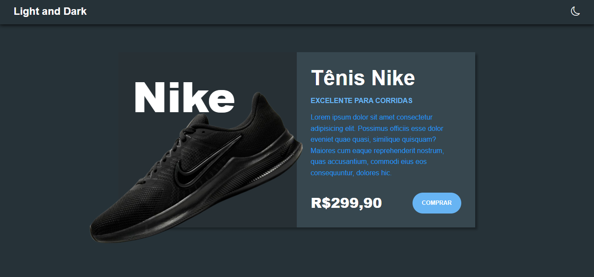

# Keyboard Ready - Aplicando Dark Mode com HTML, CSS e JavaScript

Este é um projeto de exemplo que demonstra como implementar o modo escuro (Dark Mode) em uma página web utilizando HTML, CSS e JavaScript.

### 👥 Confira:

## Funcionalidades

- Alterar entre os modos claro e escuro.
- Persistência do modo escolhido utilizando armazenamento local.

