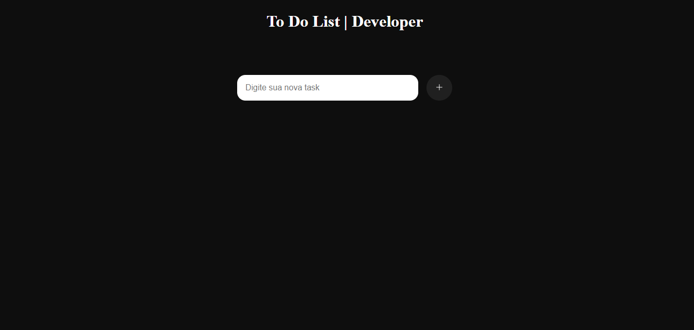

# Keyboard Ready - To-Do List </h1>
 Este é um projeto de To-Do List (lista de tarefas) desenvolvido utilizando linguagens web como HTML, CSS e JavaScript. A aplicação permite que os usuários criem, editem e removam tarefas de sua lista pessoal. 

# Funcionalidades

- Adicionar uma nova tarefa à lista.       
- Marcar uma tarefa como concluída.

### 👥 Confira:

