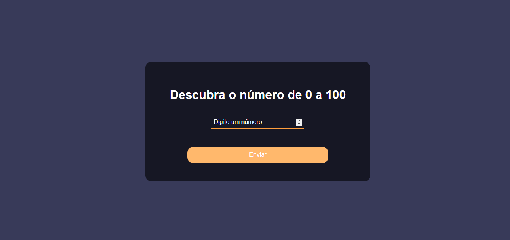

# Keyboard Ready JOGO - Descobrir o número </h1>
Projeto de um Jogo ao qual o usuário faz apostas de 0 a 100 até encontrar o número sorteado.
  

# Linguagens e Ferramentas utilizadas no Projeto:
 - Html
 - CSS
 - JS

### 👥 Confira:

