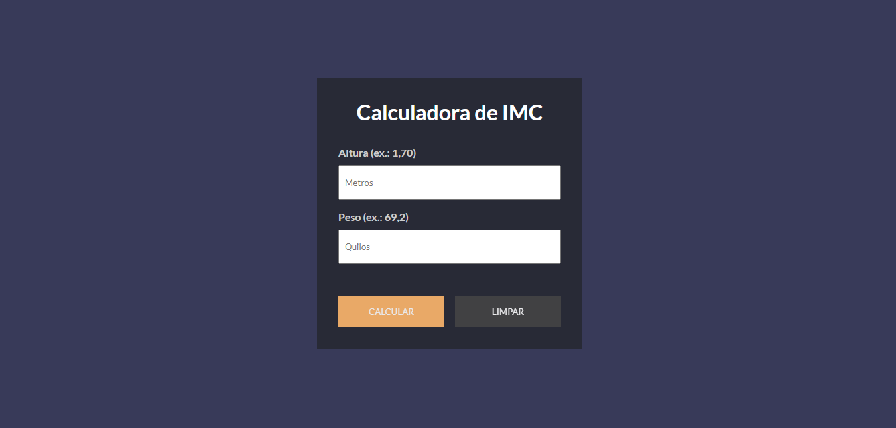
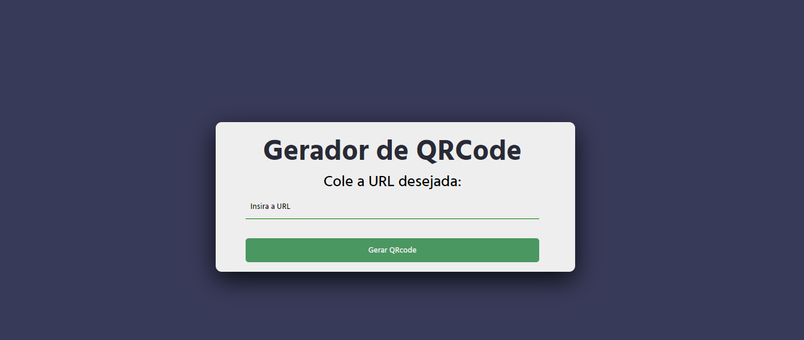
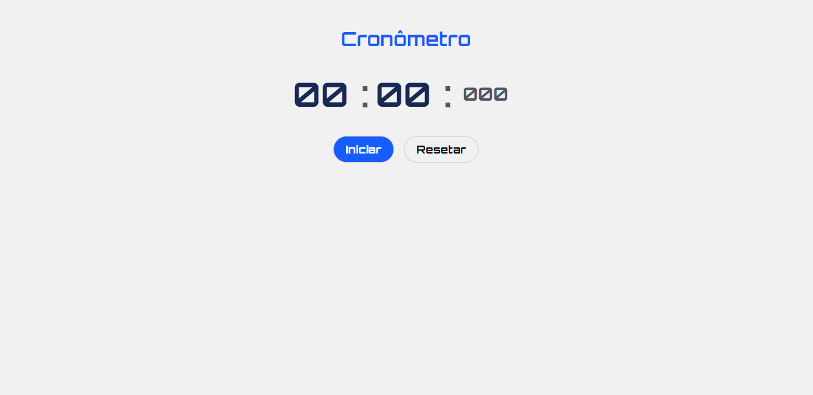
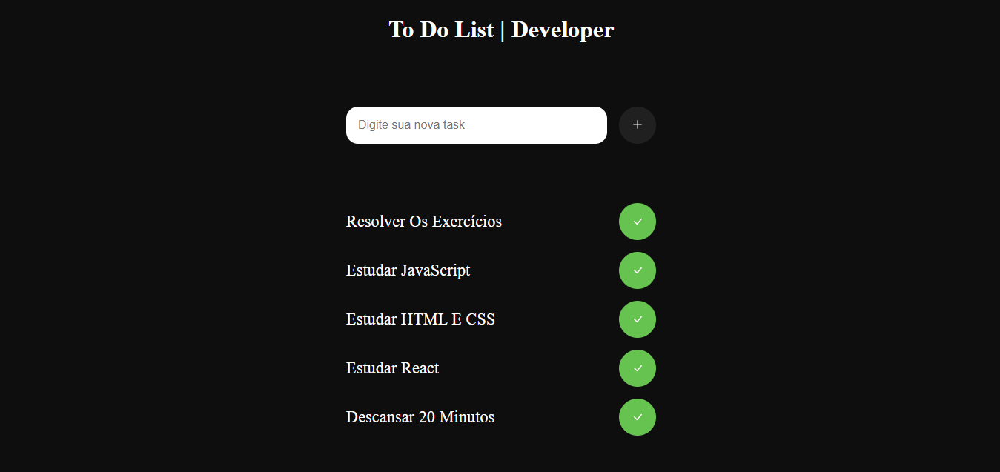
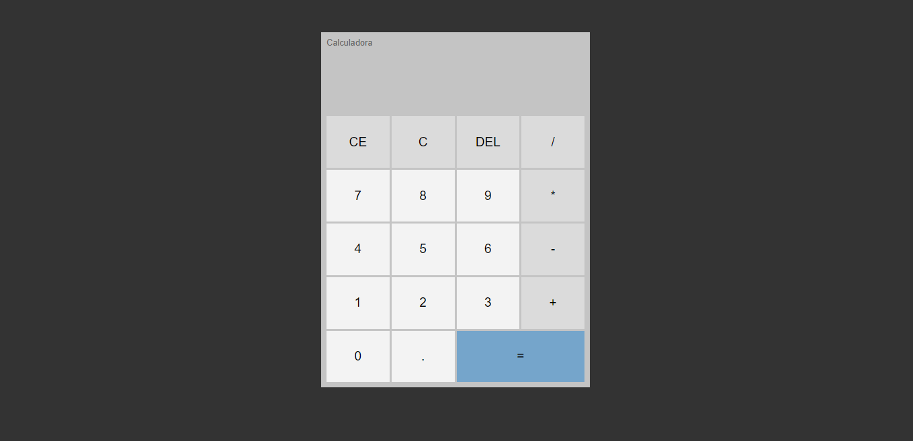

<h1 align="center">
<<<<<<< HEAD
    Keyboard Ready
=======
    keyboard Ready

>>>>>>> 09905f80ae2a9efb09b47b1d17232edcae86d63d
</h1>

    Projetos e desafios para treinar e praticar lógica de programação com HTML, CSS E JS.

<table align="center">
    <thead>
        <tr>
            <th align="center">
                 
                

                    <small>#</small>
                

            </th>
            <th align="center">
                 
                
 
                    <small>
                        TÍTULO
                    </small>
                

            </th>
            <th align="center">
                
                
 
                    <small>
                    DATA
                    </small>
                

            </th>
            <th align="center">
                
                
 
                    <small>
                    CAPA
                    </small>
                

            </th>
        </tr>
    </thead>
    <tbody>
        <tr>
            <td align="center">001</td>
            <td align="center">
                <a href="./001">DARK MODE</a>
            </td>
            <td align="center">17/08/23</td>
            <td align="center">
                
            </td>
        </tr>
    </tbody>
     <tbody>
        <tr>
            <td align="center">002</td>
            <td align="center">
                <a href="./002">Calculadora de IMC</a>
            </td>
            <td align="center">01/09/23</td>
            <td align="center">
                
            </td>
        </tr>
    </tbody>
<<<<<<< HEAD
    <tbody>
        <tr>
            <td align="center">003</td>
            <td align="center">
                <a href="./003">Calculadora de IMC</a>
            </td>
            <td align="center">02/09/23</td>
            <td align="center">
                
            </td>
        </tr>
    </tbody>
     <tbody>
        <tr>
            <td align="center">004</td>
            <td align="center">
                <a href="./004">Gerador de Senha Forte</a>
            </td>
            <td align="center">02/09/23</td>
            <td align="center">
                
            </td>
        </tr>
    </tbody>
    <tbody>
        <tr>
            <td align="center">005</td>
            <td align="center">
                <a href="./005">Relógio Digital</a>
            </td>
            <td align="center">03/09/23</td>
            <td align="center">
                
            </td>
        </tr>
    </tbody>
     <tbody>
        <tr>
            <td align="center">006</td>
            <td align="center">
                <a href="./005">Relógio Digital</a>
            </td>
            <td align="center">03/09/23</td>
            <td align="center">
                
            </td>
        </tr>
    </tbody>
     <tbody>
        <tr>
            <td align="center">007</td>
            <td align="center">
                <a href="./007">Relógio Digital</a>
            </td>
            <td align="center">04/09/23</td>
            <td align="center">
                
            </td>
        </tr>
    </tbody>
     <tbody>
        <tr>
            <td align="center">008</td>
            <td align="center">
                <a href="./008">Clima agora</a>
            </td>
            <td align="center">04/09/23</td>
            <td align="center">
                
            </td>
        </tr>
    </tbody>
     <tbody>
        <tr>
            <td align="center">009</td>
            <td align="center">
                <a href="./009">Calculadora</a>
            </td>
            <td align="center">05/09/23</td>
            <td align="center">
                
            </td>
        </tr>
    </tbody>
</table>
=======
</table>
>>>>>>> 09905f80ae2a9efb09b47b1d17232edcae86d63d
